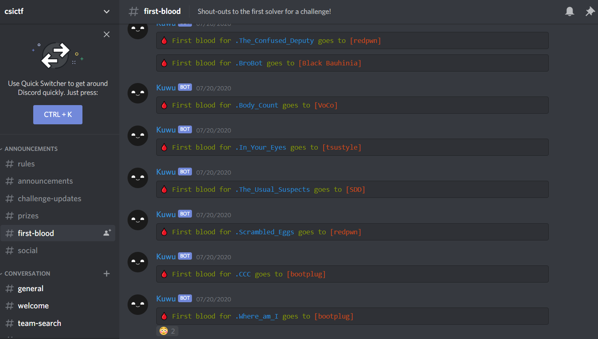

[![csivit][csivitu-shield]](https://github.com/csivitu)
[![Issues][issues-shield]](https://github.com/csivitu/Kuwu/issues)

<!-- PROJECT LOGO -->
<br />
<p align="center">
  <a href="https://github.com/csivitu/Kuwu">
    
  </a>

  <h3 align="center">Kuwu</h3>

  <p align="center">
    A friendly dicord bot used as a utility tool for CTFs
    <br />
    <br />
    <a href="https://github.com/csivitu/Kuwu">View Demo</a>
    ·
    <a href="https://github.com/csivitu/Kuwu/issues">Report Bug</a>
    ·
    <a href="https://github.com/csivitu/Kuwu/issues">Request Feature</a>
  </p>
</p>


<!-- TABLE OF CONTENTS -->
## Table of Contents

* [About the Project](#about-the-project)
  * [Built With](#built-with)
* [Getting Started](#getting-started)
  * [Prerequisites](#prerequisites)
  * [Installation](#installation)
* [Usage](#usage)
* [Roadmap](#roadmap)
* [Contributing](#contributing)
* [License](#license)
* [Contributors](#contributors-)


<!-- ABOUT THE PROJECT -->
## About The Project

<p align="center">
  <a href="https://github.com/csivitu/Kuwu">
    
  </a>
</p>

**Kuwu** is a discord utility bot implemented to be used specifically with CTF(s). It can help you organize and manage the CTF with it's varied features such as monitoring the challenges as well as first blood updates. The bot also filters out flags from the csictf discord server. It was also used in one of the challenges where teams had to DM the bot for the flag. 


### Built With

* [Python 3.5.3 or higher](https://www.python.org/)
* [Discord.py](https://discordpy.readthedocs.io/)


<!-- GETTING STARTED -->
## Getting Started

To get a local copy up and running follow these simple steps.

### Prerequisites

This is an example of how to list things you need to use the software and how to install them.
* python


### Installation
 
1. Clone the repo
```sh
git clone https://github.com/csivitu/Kuwu.git
```
2. Install python packages
```sh
pip install -r requirements.txt
```


<!-- USAGE EXAMPLES -->
## Usage

The bot is made with the help of discord.py library which is a modern, easy to use, feature-rich, and async ready API wrapper for Discord. The bot uses web sockets to connect to the challenges to perform regular health checks. The health checks were conducted every 120 seconds. Here is an example:
<p>
  <a href="">
    
  </a>
</p>

The bot also gave first blood updates and for that, selenium python library was used as ctfd requires login to access the first blood data. Here is an example of first blood updates:
<p>
  <a href="">
    
  </a>
</p>

The bot checked all messages sent to the server for filtering flags.


<!-- ROADMAP -->
## Roadmap

See the [open issues](https://github.com/csivitu/Kuwu/issues) for a list of proposed features (and known issues).


<!-- CONTRIBUTING -->
## Contributing

Contributions are what make the open source community such an amazing place to be learn, inspire, and create. Any contributions you make are **greatly appreciated**.

1. Fork the Project
2. Create your Feature Branch (`git checkout -b feature/AmazingFeature`)
3. Commit your Changes (`git commit -m 'feat: Add some AmazingFeature'`)
4. Push to the Branch (`git push origin feature/AmazingFeature`)
5. Open a Pull Request

You are requested to follow the contribution guidelines specified in [CONTRIBUTING.md](./CONTRIBUTING.md) while contributing to the project :smile:.

<!-- LICENSE -->
## License

Distributed under the MIT License. See [`LICENSE`](./LICENSE) for more information.


<!-- MARKDOWN LINKS & IMAGES -->
<!-- https://www.markdownguide.org/basic-syntax/#reference-style-links -->
[csivitu-shield]: https://img.shields.io/badge/csivitu-csivitu-blue
[csivitu-url]: https://csivit.com
[issues-shield]: https://img.shields.io/github/issues/othneildrew/Best-README-Template.svg?style=flat-square
[issues-url]: https://github.com/csivitu/repo/issues
